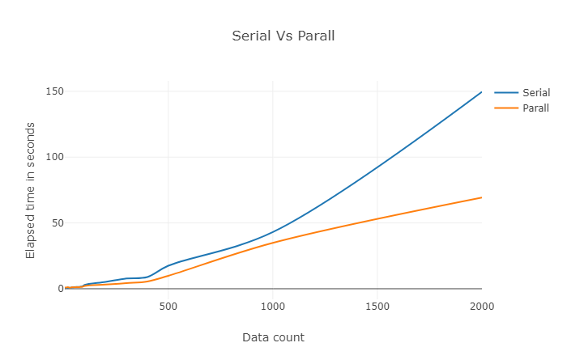

### Programming II semister project


# Introduction 

For this semister I have used the opportunity to build a solution to a problem that I faced while working at the 4K-Bots lab. One of our very first projects at the lab was to build an efficient algorithm to track a red ball on a green field so that the soccer playing bot can navigate to it and attempt to score a goal.

Building the algorithm took time as we had to test it through many senerios such as varying lighting conditions, shadows, obstacles, diffrent shades of the same color, etc. Testing it through the diffrent scenerios requires running the algorithm on a lot of images and we had to process one image  a time. This is where parall programming comes into play. 

In this notebook I will demonstarte how I can use parall programming to test a given image processing algorithm on **many sets of images** and test if I will be able to reduce the running time of the program than if I had done the process serially.

## Tools Used 

Implementing the project I have followed a **SIMD (Single Instruction Multiple Data)** architecture.
Listed below are some of the tools and libraries to develop this project. For demonstrating the step by step procedure I followed I have used **Jupyter notebook**.

For implementing the proposed SIMD architecture on python I will use **multiprocessing**. As its name puts it multiprocessing is a python module that includes a very simple and intuitive API for dividing work between multiple processes.

## Work Done

The first task at hand was collecting image data sets to run the algorithms on. For that, I have collected sample images from 4K-Bots and placed them in the **img** folder. 

For demonstration purposes, I will be applying basic filters such as gray filter, blurring, edge, and color segmentation. To do this I will use **openCv**, an Open Source computer vision library with multiple programming functions mainly aimed at real-time computer vision.

To process the images using openCv we have to first import it into our program using the following python statement.


```python
import cv2 #Imports the opencv module
```

Converting a given image to a grayscale image can be done using the OpenCV method `cvtColor()` passing `COLOR_BGR2GRAY` as the argument. I will create a function that will read a list of file names and convert each file in the given list to a gray-scale image. 


```python
def convert_to_gray(files): #Define a function called convert_to_gray that takes list as an argument
    for path in files: #Iterate through each element of the list
        image = cv2.imread(path) #Open and save the file
        gray = cv2.cvtColor(image, cv2.COLOR_BGR2GRAY) #Convert the rgb image to a gray scale image
        cv2.imwrite(path, gray) #Save the converted image with the same name to repalce the old one
```

To test the function above I will first create a list of file names and pass the list to the `convert_to_gray` method.


```python
#Create a list of files
files = [
    '.\\img\\156213641755.jpg', 
    '.\\img\\156213641756.jpg', 
    '.\\img\\156213641757.jpg',
]
#Call the function passing the files list as an argument
start_time = time.time() 
convert_to_gray(files)
elappsed_time = time.time() - start_time
print("Time elapsed {} seconds".format(elappsed_time))
```

    Time elapsed 0.18565130233764648 seconds
    

`Time elapsed 0.18565130233764648 seconds`

We can see that for a small set of files it doesn't take long to process the files. Let's see if it runs as quick on a relatively larger data set. To build the list I will get the entire content of the img folder and save it to a list called `files`.


```python
import os # import the os module

path = '.\\img' # Indcates where to look for 
files = [] # Create the 
# r=root, d=directories, f = files
for r, d, f in os.walk(path):
    for file in f:
          files.append(os.path.join(r, file)) # Read the file name and save to the list
            
print("Imported {} files.".format(len(files)))

    
```

    Imported 2064 files.
    


```python
start_time = time.time() 
convert_to_gray(files)
elappsed_time = time.time() - start_time
print("Time elapsed {} seconds".format(elappsed_time))

```

    Time elapsed 0.21666598320007324 seconds
    

Running the same code on a larger dataset obviously took a long time to run. Now let's see if we can reduce the execution time by dividing the work among the multiple processes using the `multiprocessing` module. 

To do this, I will first initialize a Pool with the available number of processors in my computer and pass the function I want to parallelize to one of Pools parallelization methods. `multiprocessing.Pool()` provides the `apply()`, `map()` and `starmap()` methods to make any function run in parallel. Here I will be using the `map()` method as it is simpler to demonstrate and faster than the other options.

To start with lets first re-shape the list to a matrix type format so that the work can be easily split to the processors. Below I have defined a function that will take a linear list and will re-shape the given list of file names into an `n X m` matrix as provided in the `new_row` and `new_col` arguments.


```python
def change_shape(main_list, new_row, new_col): # Define a function called change_shape
    new_mat = [] # Define an empty list
    ins_col_count = 0 
    temp_list = []
    for element in main_list:
        temp_list.append(element)
        ins_col_count = ins_col_count + 1

        if ins_col_count == new_col:
            new_mat.append(temp_list)
            temp_list = []
            ins_col_count = 0
    return new_mat # return the new matrix 
```

The following statment will change the 1 X n list to a 100 X 4 matrix.


```python
new_files = change_shape(files, 100, 4)
```


```python
import multiprocessing as mp
import workers

if __name__ == "__main__": 
    
    pool = mp.Pool(mp.cpu_count())
    start_time = time.time()
    pool.map(workers.convert_to_gray, [file for file in new_files])
    pool.close()
    elappsed_time = time.time() - start_time
    print("Time elapsed {} seconds".format(elappsed_time))
    


```

    Time elappsed 76.70435190200806 seconds
    


```python
import workers
N = [5, 10, 20, 30, 40, 50, 60, 70, 80, 90, 100, 200, 300, 400, 500, 1000, 2000]
print("ET -> Elapsed Time")
print("Data count\tSerial ET\tParalle ET")
print("--------------------------------------------")
for n in N: 
    new_mat = files[:n]
    start_time = time.time()
    convert_to_gray(new_mat)
    serial_elappsed_time = time.time() - start_time
    
    new_mat = change_shape(new_mat, len(new_mat), 4)
    pool = mp.Pool(mp.cpu_count())
    start_time = time.time()
    pool.map(workers.convert_to_gray, [file for file in new_mat])
    pool.close()
    parall_elappsed_time = time.time() - start_time
    print("{}\t\t{}\t\t{}".format(n, round(serial_elappsed_time, 4), round(parall_elappsed_time, 4)))
    
    
    
```

    ET -> Elapsed Time
    Data count	Serial ET	Paralle ET
    --------------------------------------------
    5		0.3828		1.1963
    10		0.5099		0.9671
    20		0.6075		0.8956
    30		0.7222		0.8871
    40		0.8192		0.9231
    50		1.0252		0.9902
    60		1.1789		1.1393
    70		1.5491		1.2393
    80		1.5095		1.2378
    90		1.6639		1.3399
    100		1.8913		1.6926
    200		3.8525		2.6363
    300		5.6944		3.2402
    400		8.82		4.3014
    500		10.1836		14.0874
    1000		31.9324		29.1812
    2000		76.1707		65.4987
    



## Conclusion

Seeing from the table and the plot I was able to observe that for a small amount of files the program will more or less will take the same amount of time both in serial and parall. But as the data grows larger and larger the parall code will run much faster as compared to the serial code.
